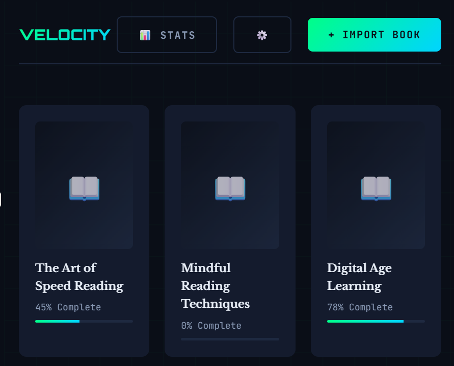
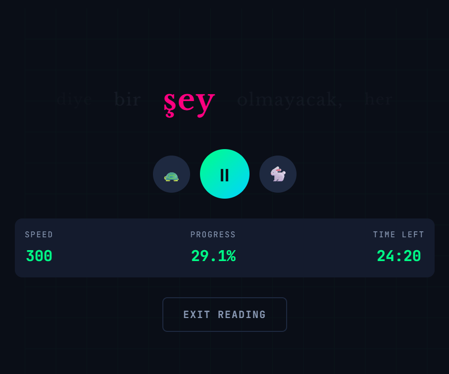
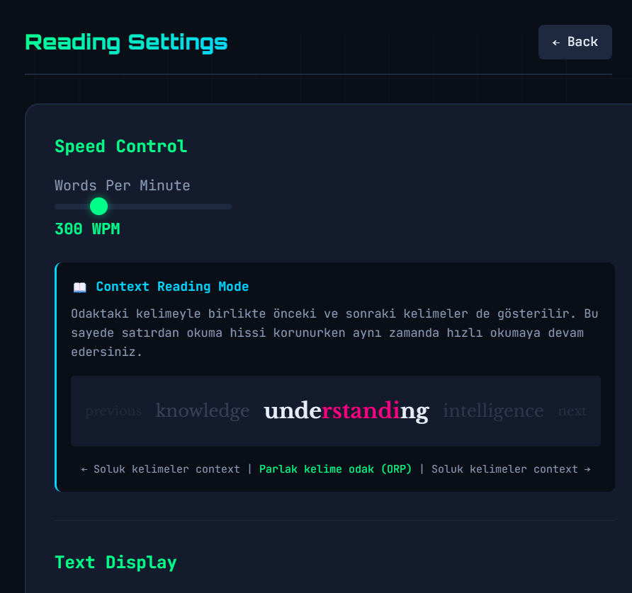
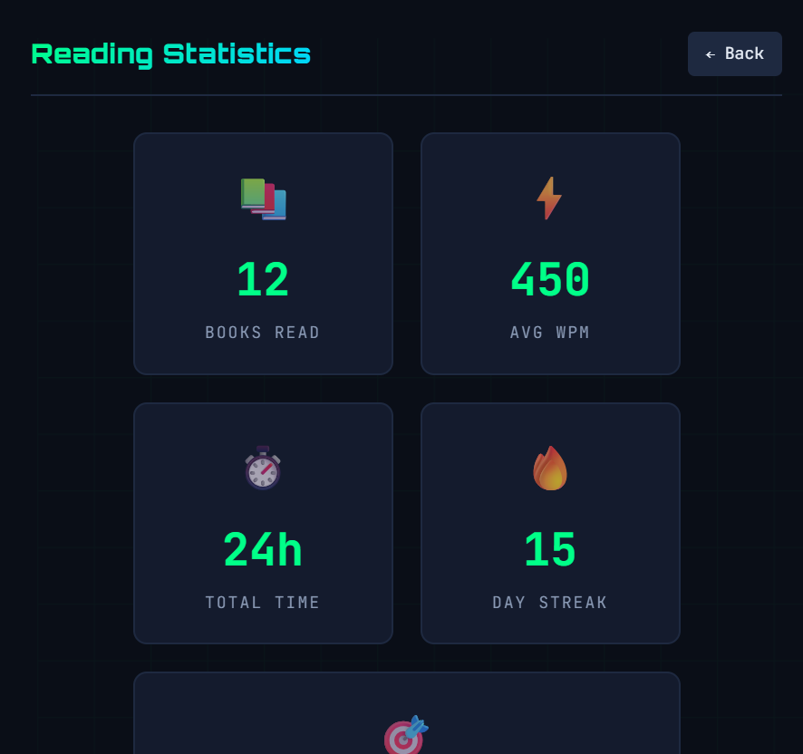

#   Velocity - Next-Gen Speed Reader

> **"Okuma hızını konforundan ödün vermeden 3 katına çıkar."**

Velocity, metni sabit bir noktada yakıp söndürmek yerine satır akışını koruyan, hız okuma deneyimini yeniden tanımlayan bir uygulamadır. Kitap okuma zevkini yoğun tempoda kaybetmemek amacıyla, tamamen **Claude 4.5 Sonnet** ile yapılan bir **Vibe Coding** seansının ürünü olarak geliştirilmiştir.

---

##   "Linear RSVP": Satır Akışı İnovasyonu

Geleneksel RSVP araçları kelimeleri ekranda tek bir noktaya hapsederek okuyucuyu metnin akışından koparabilir. Velocity ile bu soruna mühendislik odaklı bir çözüm getirdim:

* **Contextual Flow (Satır Akışı):** Kelimeler tek noktada çakılı kalmaz; önceki ve sonraki kelimeleri (hafif silik şekilde) görerek gerçek bir satır üzerinde ilerleme hissi yaşarsınız.
* **Doğal Odaklanma:** Gözün cümle içindeki konumunu hissetmesi sağlanır, bu da anlama oranını (comprehension) ciddi şekilde artırır.
* **Bionic Highlighting:** Kelimelerin en vurucu kısımlarını vurgulayarak beynin kelimeyi tanıma süresini minimize eder.

---

##   Behind the Scenes: Vibe Coding

* **AI Collaboration:** **Claude 4.5 Sonnet**'in gücüyle; RSVP teorisi ve göz hareketleri üzerine yapılan araştırmaların ışığında, detaylı prompt stratejileriyle inşa edilmiştir.
* **Verimlilik:** Kısıtlı zamanı en verimli şekilde kullanmak için yapay zeka ile iş birliği yapılmıştır.

---

##   Screenshots

### Library View

### Linear Reading Session

### Book Preview & Analytics

### Statistics

---

##   Özellikler

* **Akıllı Vurgulama:** Kelime uzunluğuna göre odak noktasını (ORP) dinamik hesaplayan yapı.
* **EPUB Desteği:** Kitapları sürükle-bırak yöntemiyle saniyeler içinde kütüphaneye aktarma.
* **Kişiselleştirme:** 100-1000 WPM arası hız kontrolü, yazı tipi boyutu ve renk şemaları.
* **PWA Desteği:** Tarayıcı üzerinden "Ana Ekrana Ekle" diyerek gerçek bir uygulama gibi tam ekran kullanım.

